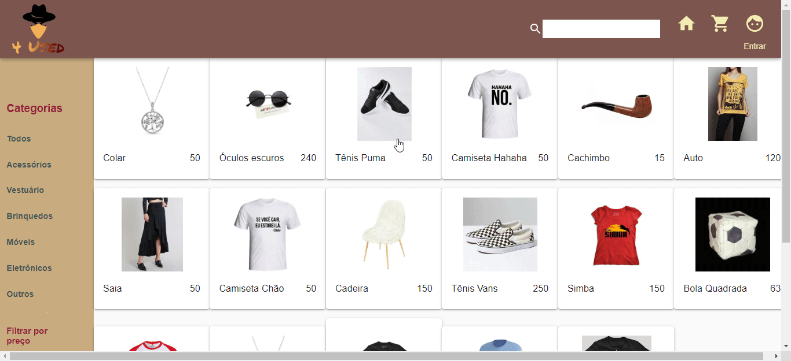

# Projeto Em Grupo 4Used



<hr>

## Descrição do projeto

4 Used é um marketplace voltada a compra e venda de produtos usados.


## Funcionalidades

- Área de criação de anúncios
- Área de busca de produtos
- Listagem de produtos
- Filtrar por valor mínimo e máximo
- Filtrar por categoria

## Linguagens e libs utilizadas

- [React](https://pt-br.reactjs.org/tutorial/tutorial.html)
- [Material-ui](https://material-ui.com/)
- [Styled-components](https://styled-components.com/)
- [axios](https://github.com/axios/axios)

## Como baixar o programa

```bash
# Clonar o projeto

$ git clone https://github.com/Luiz326/marketplace.git

# Entrar no diretório
$ cd 4used

# Instalar as dependências

npm install

# Iniciar o projeto

npm start
```

### Membros

- Késsia Lopes
- Luiz Mitsuru Dai
- Thiago Stephen
- Yuzo Santana Okamoto
